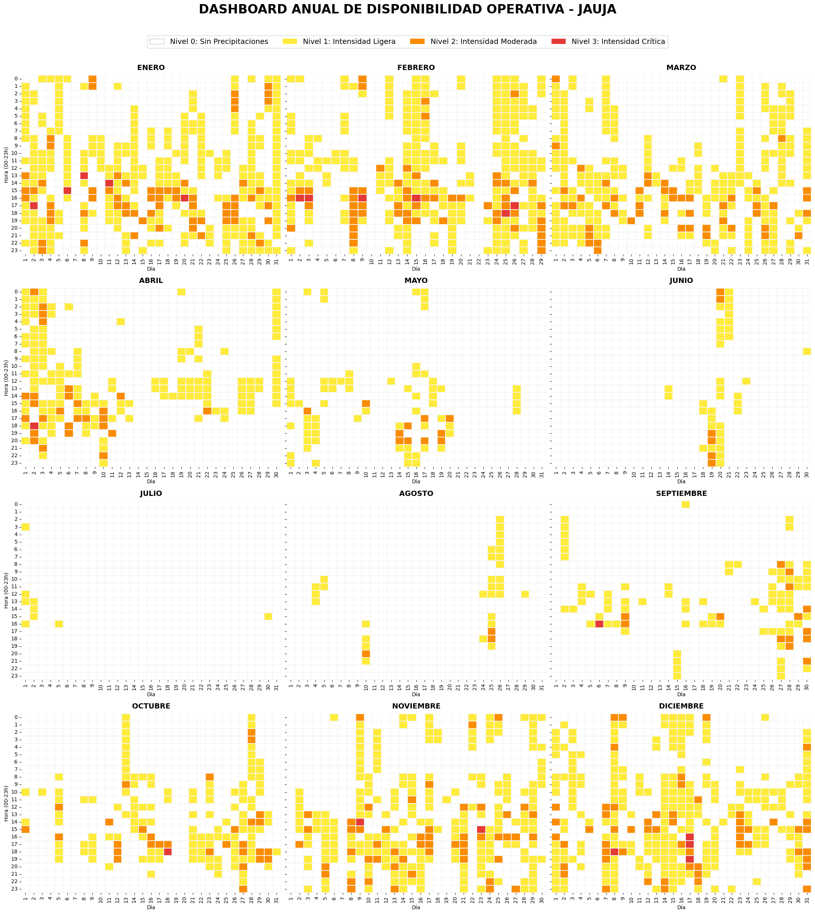

# 📊 Análisis de Disponibilidad Operativa: Caso Jauja, Perú
### Por: Stefany Silva | Ingeniera Industrial

## 📝 Descripción
Este proyecto desarrolla un modelo de análisis de datos climáticos para la región de Jauja. Utilizando Python y la API de Open-Meteo, se procesaron registros de precipitaciones para determinar ventanas óptimas de operación y riesgos climáticos.

## 🚀 Tecnologías Utilizadas
* **Lenguaje:** Python (Google Colab)
* **Librerías:** Pandas, Seaborn, Matplotlib, Open-Meteo API.
* **Metodología:** Clasificación de riesgo operativo en 4 niveles (0-3).

## 📈 Visualización Principal: Dashboard Anual
Este dashboard muestra la intensidad de lluvia por cada hora de cada día del año, permitiendo identificar la estacionalidad crítica.

## 💡 Insights de Ingeniería
* **Temporada Crítica:** Identificación de niveles de riesgo 3 (rojo) concentrados entre enero y marzo.
* **Optimización:** Las ventanas de operación segura (Nivel 0) se maximizan entre los meses de mayo y agosto.
* **Aplicación:** Este análisis permite la planificación eficiente de logística, construcción y actividades al aire libre.

## 📂 Contenido del Repositorio
* `analisis_meteorologico_jauja.ipynb`: Código completo en Python.
* `datos_meteorologicos_jauja_2024.csv`: Dataset procesado para replicar el estudio.

## ✉️ Contacto

Si tienes alguna duda sobre este análisis o quieres conectar profesionalmente, puedes encontrarme en:

También puedes escribirme directamente a través de GitHub.
